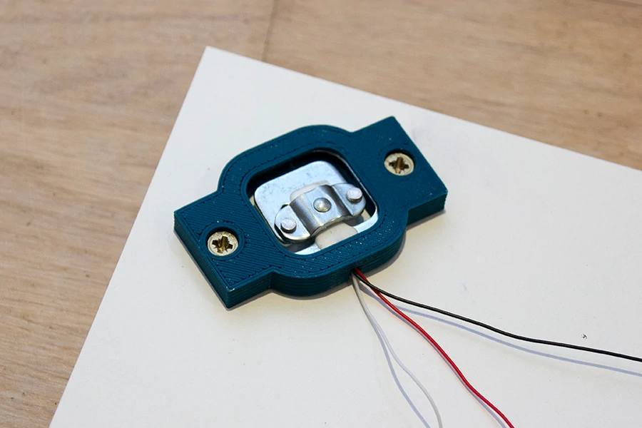
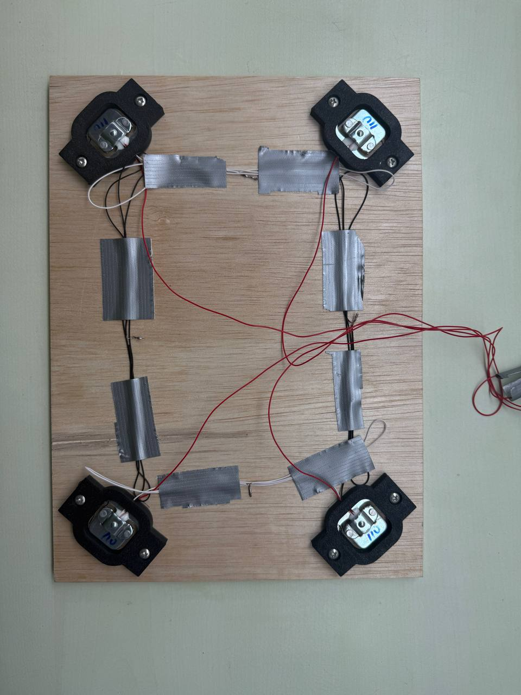
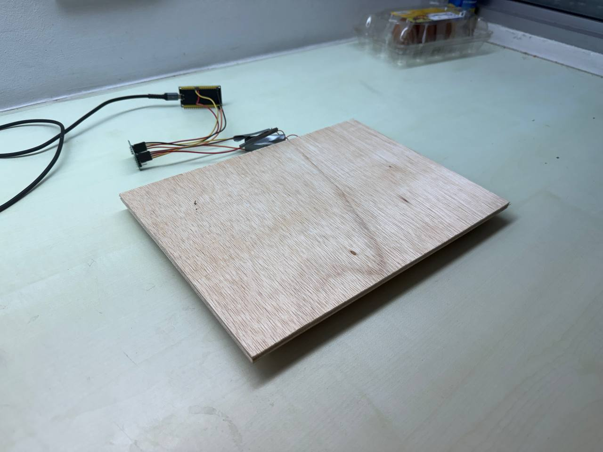
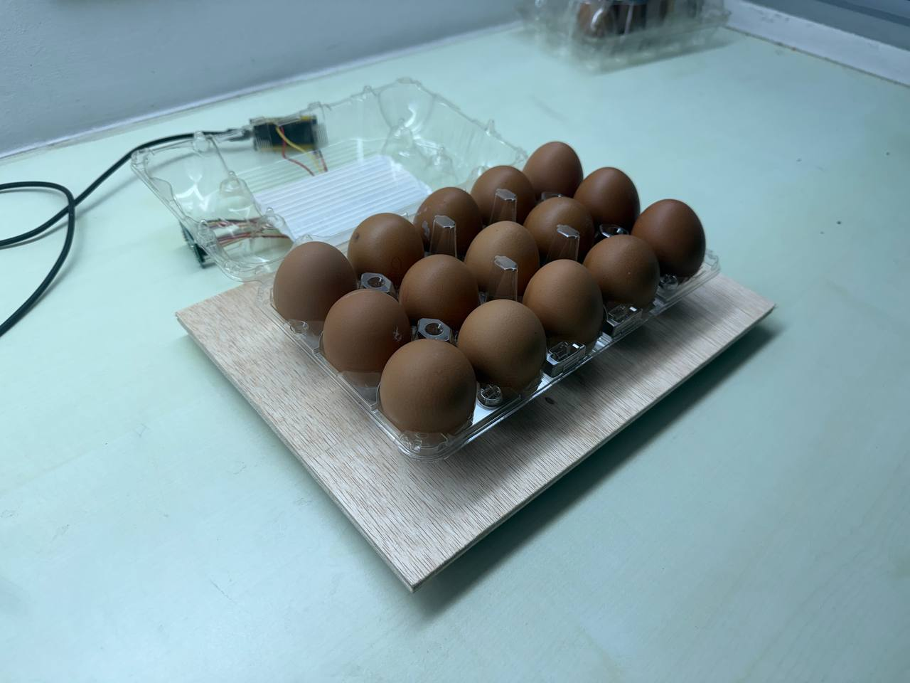

# 🔩 TrayTrack Firmware — ESP32 Load-Cell Sensor Node

This is the code that runs on the small board **under each buffet tray**. Its one job sounds simple — *measure how much food is on the tray and send it to the cloud* — but doing that reliably in a hot, humid, WiFi-flaky kitchen is where most of the engineering went.

Each tray gets one sensor node. The node reads four load cells, converts the signal to grams, cleans up the noise, and POSTs a reading to the [Supabase Edge Function](../supabase/README.md) every few seconds — buffering data locally if the WiFi drops so nothing is ever lost.

---

## 📸 The build

Real, working hardware — not a render. This is the actual sensor node built for the competition.

<table>
  <tr>
    <td width="50%" valign="top">
      <br>
      <em><b>The brain.</b> The ESP32-WROOM dev board — WiFi microcontroller that reads the scale and streams to the cloud.</em>
    </td>
    <td width="50%" valign="top">
      <br>
      <em><b>One corner.</b> A 50 kg load cell seated in its 3D-printed bracket, 3-wire (red / black / white).</em>
    </td>
  </tr>
  <tr>
    <td width="50%" valign="top">
      <br>
      <em><b>The bridge.</b> Underside of the platform — four load cells at the corners, wired into one Wheatstone bridge.</em>
    </td>
    <td width="50%" valign="top">
      <br>
      <em><b>Assembled.</b> The finished weighing platform connected through the HX711 amplifier to the ESP32.</em>
    </td>
  </tr>
  <tr>
    <td width="50%" valign="top">
      <br>
      <em><b>Live test.</b> A real egg tray on the platform, streaming its weight to the TrayTrack dashboard in real time.</em>
    </td>
    <td width="50%" valign="top"></td>
  </tr>
</table>

---

## 🧰 Hardware — Bill of Materials

### Electronics (per tray)

| Part | Spec / role |
|---|---|
| **MCU** | ESP32-WROOM-32U — WiFi microcontroller, runs this firmware |
| **ADC** | HX711 — 24-bit analog-to-digital converter built for load cells |
| **Load cells** | 4× 50 kg bar-type strain-gauge cells, combined into one Wheatstone bridge |
| **Platform** | Rigid top plate + base plate, one load cell mounted at each corner |
| **Power** | USB 5 V from a kitchen power outlet |

### Load-cell mount hardware

| Item | Size | Qty |
|---|---|---|
| Socket-head cap screws (stainless) | M5 × 20 mm | 16 |
| Flat washers (stainless) | M5 | 16 |
| Lock washers *or* Loctite 243 | M5 | 16 |
| Heat-set threaded inserts | M3 × 4 mm | 8–12 |
| Socket-head cap screws (bracket) | M3 × 10 mm | 8–12 |
| Countersunk flat-head screws | M5 × 16 mm | 8 |
| M5 nuts | M5 | 8 |

> 🛒 **Shopee shortcut:** search *"M3 M5 stainless steel socket cap screw assortment kit"* (~SGD 8–12).
>
> ⚠️ **Build notes that matter:**
> - **Stainless steel only** — kitchens are humid and everything else rusts.
> - **Don't overtighten M5 into the load cell** — the threads are aluminium and strip easily.
> - **All four cells must sit at exactly the same height**, or the platform rocks and readings drift.

---

## 🔌 Wiring — 4 load cells into one bridge

Four 50 kg half-bridge cells combine into a single full **Wheatstone bridge**, which the HX711 reads. Each cell has three wires (RED / BLACK / WHITE):

```
   All RED   ──────────► E+   (excitation +)
   All BLACK ──────────► E−   (excitation −)
   Diagonal WHITE pair ► A+   (signal +)
   Other WHITE pair    ► A−   (signal −)
```

Then the HX711 connects to the ESP32:

| HX711 pin | ESP32 pin | Set in |
|---|---|---|
| `DT` (data)  | **GPIO 16** | `config.h` → `HX711_DT_PIN` |
| `SCK` (clock)| **GPIO 4**  | `config.h` → `HX711_SCK_PIN` |
| `VCC` | 3V3 (or 5V) | — |
| `GND` | GND | — |

A push-button to **GPIO 0** (the BOOT button on most ESP32 dev boards) triggers calibration mode — hold it while powering on.

---

## 🧠 How the firmware works

The firmware is deliberately split into small modules instead of one giant `.ino`, so each concern can be reasoned about and tested on its own:

| File | Responsibility |
|---|---|
| [`tray-sensor.ino`](./tray-sensor/tray-sensor.ino) | Main loop — orchestrates read → filter → average → upload timing |
| [`sensor.cpp` / `.h`](./tray-sensor/sensor.cpp) | HX711 driver, calibration, outlier-rejecting averaging, SPIFFS calibration storage |
| [`network.cpp` / `.h`](./tray-sensor/network.cpp) | WiFi connect with backoff, HTTP upload, buffer flush |
| [`buffer.cpp` / `.h`](./tray-sensor/buffer.cpp) | Offline resilience — RAM ring buffer + SPIFFS overflow |
| [`config.h`](./tray-sensor/config.h) | All the knobs: WiFi creds, Supabase URL, pins, timing, thresholds |

### The main loop, in plain English

```
every 1 s   →  read one weight sample, run it through the spike filter,
               add it to a running average
every 7 s   →  average the samples collected this window,
               upload the averaged value (or buffer it if offline),
               then reset the running average
```

Averaging over a 7-second window before uploading smooths out sensor jitter *and* keeps the database from being flooded with noisy raw readings.

### Four things that make the readings trustworthy

1. **Outlier-rejecting average** (`getAveragedWeight`) — takes N samples, sorts them, throws away the single highest and single lowest, and averages the rest. One bad spike can't skew the reading.
2. **Spike debounce** (in the main loop) — a sudden change over **500 g** is treated as suspect (someone resting a hand on the tray, a serving spoon dropped in). It's only accepted as real if it *persists* past the debounce window (`DEBOUNCE_MS`, default 3 s). Transient bumps are ignored.
3. **Validity bounds** — any reading outside `−100 g … 60000 g` is discarded as a hardware glitch before it ever leaves the board.
4. **Container tare** — the empty container weight is subtracted (at calibration time on the board, and again against the dish tare in the database) so the dashboard measures **only the food**.

### Never lose a reading — offline buffering

Kitchen WiFi is unreliable, so the firmware assumes it *will* drop:

- If an upload fails or WiFi is down, the reading is pushed into a **150-entry RAM ring buffer**.
- If RAM fills past 80% (`SPIFFS_OVERFLOW_THRESHOLD`), older entries spill over to **flash storage (SPIFFS)** as JSON-lines — surviving even a power cycle.
- When WiFi returns, `flushBuffer()` drains the backlog **oldest-first** (SPIFFS before RAM), throttled to avoid flooding the server, re-buffering anything that still fails.
- WiFi reconnection uses **exponential backoff** (2 s → 4 s → … → 32 s) so a downed router doesn't hammer the network.

Every reading carries its own `recorded_at` timestamp, so buffered data lands in the database with the time it was *measured*, not the time it was finally uploaded.

---

## ⚖️ Calibration procedure

Raw load-cell output is meaningless until it's calibrated against a known weight. TrayTrack makes this a guided, on-device routine — no re-flashing needed.

1. **Power on while holding the BOOT button** (GPIO 0). The board enters `CALIBRATION MODE`.
2. Open the **serial monitor** at **115200 baud**.
3. Follow the prompts:
   - Place the **empty tray** → the firmware tares it (averages 20 readings as the zero offset).
   - Place a **known weight** (e.g. a labelled 2 kg mass) and type its weight in grams.
   - The firmware computes the **calibration factor** = raw delta ÷ known grams, verifies it, and **saves it to SPIFFS** (`/calibration.json`).
4. The board restarts and runs normally — calibration persists across reboots and power loss.

If no saved calibration is found, the firmware falls back to `DEFAULT_CALIBRATION_FACTOR` in `config.h` and tares on boot.

---

## 🚀 Build & flash (PlatformIO)

The project uses [PlatformIO](https://platformio.org/) (VS Code extension recommended).

```bash
# 1. Configure your node — edit firmware/tray-sensor/config.h:
#    WIFI_SSID, WIFI_PASSWORD
#    SUPABASE_URL, SUPABASE_ANON_KEY
#    SENSOR_ID   (the sensor's UUID from the `sensors` table — see supabase/README.md)

# 2. From firmware/tray-sensor/, build & upload:
pio run --target upload

# 3. Watch it run:
pio device monitor        # 115200 baud
```

Dependencies are declared in [`platformio.ini`](./tray-sensor/platformio.ini) and fetched automatically:

- `bogde/HX711` — load-cell ADC driver
- `bblanchon/ArduinoJson` — JSON encode/decode for uploads and buffering

### Key configuration knobs (`config.h`)

| Setting | Default | Meaning |
|---|---|---|
| `READ_INTERVAL_MS` | `1000` | How often to sample the load cell |
| `UPLOAD_INTERVAL_MS` | `7000` | How often to upload an averaged reading |
| `DEBOUNCE_MS` | `3000` | Ignore weight spikes shorter than this |
| `RAM_BUFFER_SIZE` | `150` | Offline readings kept in RAM |
| `WEIGHT_MIN/MAX_GRAMS` | `−100 / 60000` | Valid reading bounds |
| `WIFI_RECONNECT_MAX_MS` | `32000` | Cap on reconnect backoff |

---

## 📤 What a reading looks like on the wire

The node POSTs JSON to `{SUPABASE_URL}/functions/v1/ingest-reading`:

```json
{
  "sensor_id": "a1b2c3d4-…",
  "weight_grams": 2450.5,
  "readings_count": 7,
  "recorded_at": 1719763200000
}
```

From there, the [backend](../supabase/README.md) validates it, stores it, updates the tray, and the [web dashboard](../web/README.md) reflects it live within seconds.

---

## 🙏 Credits & references

The physical load-cell platform — wiring four 50 kg cells into a Wheatstone bridge and reading them with an HX711 on an ESP32 — was built with reference to this excellent tutorial. Full credit to the creator for the clear walkthrough that helped us get our hardware working:

> 📺 **[Building a load-cell scale with ESP32 + HX711](https://youtu.be/LIuf2egMioA)** — by **_[creator / channel name — to confirm]_**

We adapted the approach for a buffet-tray form factor (3D-printed corner brackets, kitchen-grade stainless hardware) and built the firmware, calibration workflow, offline buffering, and cloud pipeline on top of it.

*If you found this project useful, please credit **Team EcoWaves — TrayTrack** in turn.*
